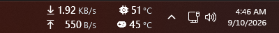
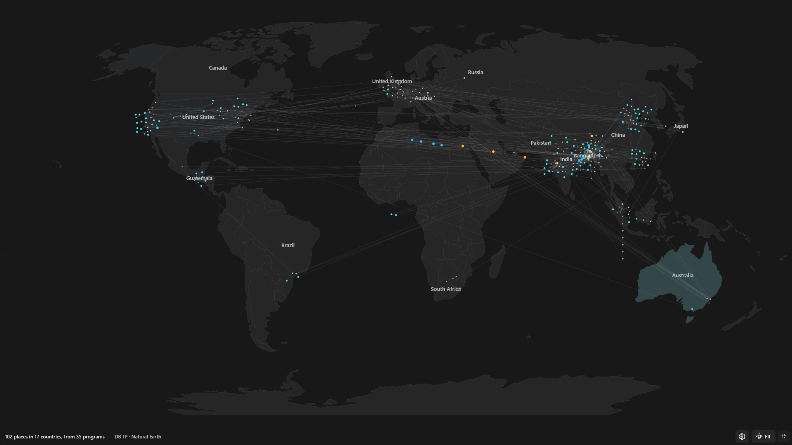
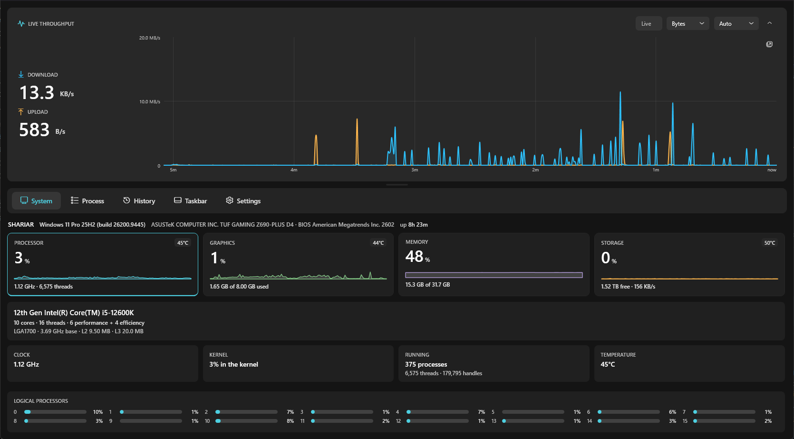
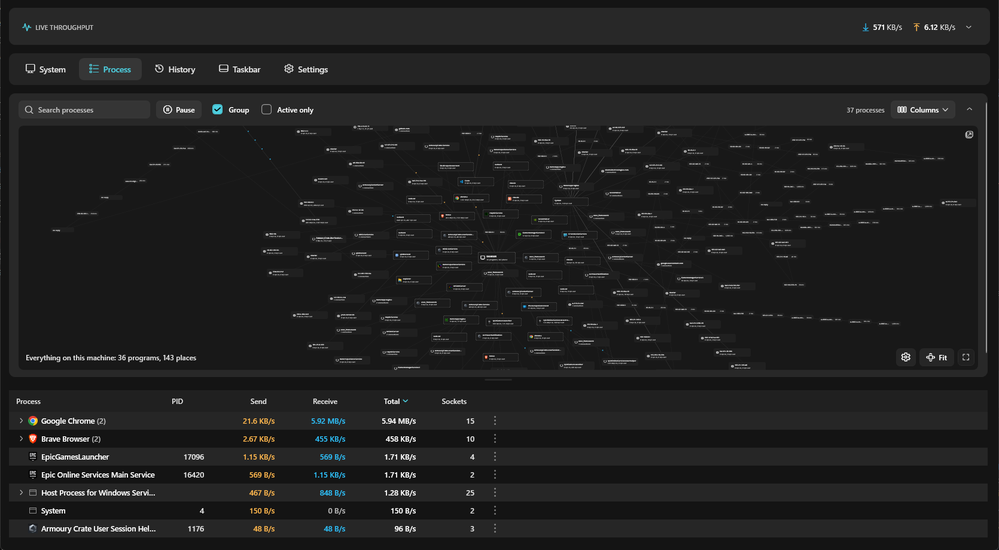
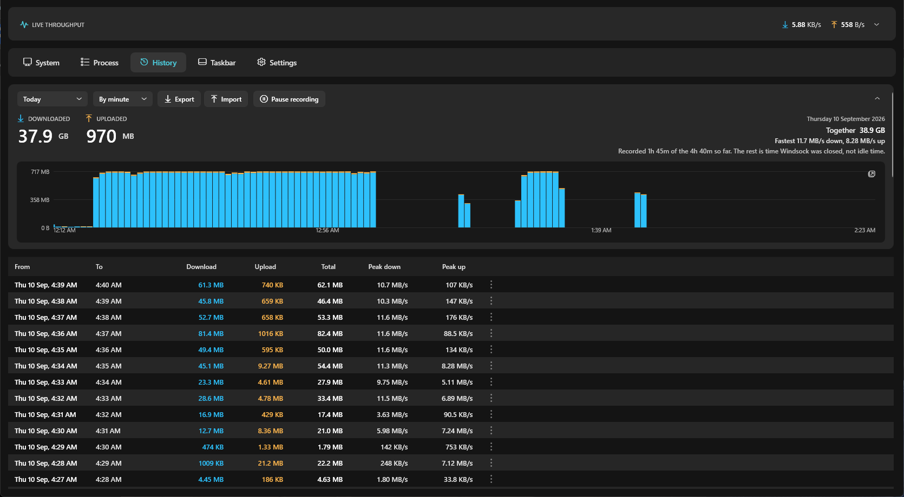
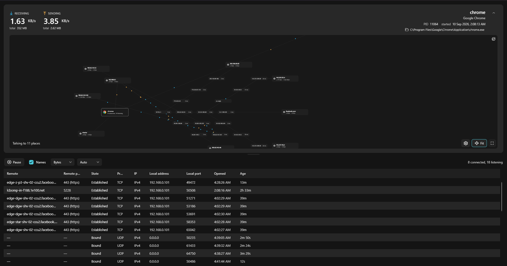
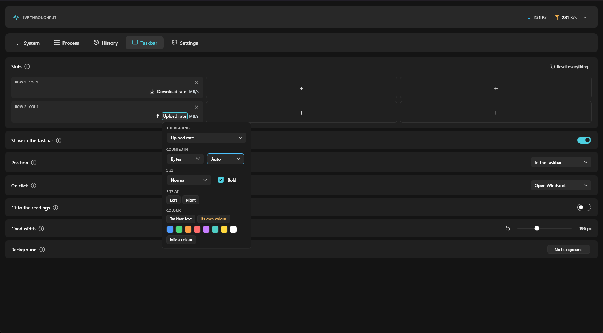

<div align="center">


# Windsock

Network speed meter for the Windows 11 taskbar.

[](https://github.com/ShariarShuvo1/Windsock/actions/workflows/build.yml)
[](https://github.com/ShariarShuvo1/Windsock/releases/latest)
[](LICENSE)

<a href="https://apps.microsoft.com/detail/9NWQF5ZF6DQK">
  
</a>
&nbsp;
<a href="https://github.com/ShariarShuvo1/Windsock/releases/latest">
  
</a>

<br>



<sub>Live rates and temperatures, in the taskbar itself.</sub>

</div>

---

Live upload and download rates on the taskbar itself, a table of which programs
are using the network, a map of where their traffic goes, and per-minute history
you can chart and export.



## Features

**Taskbar meter.** Up to six slots on the Windows 11 taskbar, either docked
inside it or floating above it. Each slot shows network rates, processor,
graphics, memory or storage readings, with independent units and colour.

**Live view.** Download and upload against a rolling 30 minute chart. Zoom the
time axis with the wheel, hover for values, and set the sampling interval
anywhere from 100 ms to an hour.

**History.** Every minute is recorded to a local SQLite database and stays at
full resolution. Query any period by minute, hour or day. Export and import CSV.
A year is about a dozen megabytes.

**Processes.** Per-process upload and download rates, open sockets, and the
remote address of each connection. Loopback connections are resolved to the
program at the other end instead of showing `127.0.0.1`.

**Network map.** Traces the route to each remote address with ICMP and merges
shared hops, so the graph shows which branch of the network carries the traffic.
Can be drawn on a world map using an offline geolocation database.

**System.** Processor, memory, graphics and storage readings with per-core bars.
Graphics temperatures for NVIDIA, AMD and Intel adapters.

<table>
<tr>
<td width="50%"><br><sub><b>System</b>: processor, graphics, memory and storage, with per-core bars and temperatures.</sub></td>
<td width="50%"><br><sub><b>Processes</b>: per-process rates and sockets, over a graph of where the traffic goes.</sub></td>
</tr>
<tr>
<td width="50%"><br><sub><b>History</b>: any period by minute, hour or day. Gaps are drawn as gaps, not zeroes.</sub></td>
<td width="50%"><br><sub><b>One program</b>: double-click a row for its own rates, sockets and routes.</sub></td>
</tr>
<tr>
<td colspan="2"><br><sub><b>Taskbar</b>: each slot picks its own reading, units, size, alignment and colour.</sub></td>
</tr>
</table>

## Install

| | Edition | Updates |
| --- | --- | --- |
| [Microsoft Store](https://apps.microsoft.com/detail/9NWQF5ZF6DQK) | Store | Automatic |
| [`Windsock-win-Setup.exe`](https://github.com/ShariarShuvo1/Windsock/releases/latest) | Full | Automatic |
| [`Windsock-win.msi`](https://github.com/ShariarShuvo1/Windsock/releases/latest) | Full | Automatic |
| [`Windsock-win-Portable.zip`](https://github.com/ShariarShuvo1/Windsock/releases/latest) | Full | Manual |

`Windsock-win-Setup.exe` installs for you alone and needs no administrator
rights. `Windsock-win.msi` installs the same thing through a wizard and is the
only one that can install for everyone on the machine, which does need an
administrator. Every download includes the .NET runtime.

The MSI takes `VELOPACK_INSTALLDIR` if you want it somewhere specific:

```powershell
msiexec /i Windsock-win.msi VELOPACK_INSTALLDIR="D:\Apps\Windsock"
```

### Editions

| | Full | Store |
| :-- | :--: | :--: |
| Live rates, history, taskbar meter, system readings | Yes | Yes |
| Process table and network map | Yes | No |
| Processor temperature | Yes | No |
| Code signed | No | Yes, by Microsoft |

The two excluded features require administrator rights, which a Store app cannot
obtain. They are removed from the Store build rather than disabled in it.

Windsock installs no kernel driver and contains none.

### Verifying a download

Releases are built by GitHub Actions and carry a `SHA256SUMS.txt` plus a build
provenance attestation.

```powershell
Get-FileHash Windsock-win-Setup.exe -Algorithm SHA256
gh attestation verify Windsock-win-Setup.exe --repo ShariarShuvo1/Windsock
```

Windsock is not code signed, so Windows will warn that the publisher is
unrecognised. The Store build is signed by Microsoft.

## The taskbar meter

Windows 11 removed deskbands, so the meter is offered two ways:

- **Docked** makes the meter a child of Explorer's `Shell_TrayWnd` and places it
  against the notification area. It moves and hides with the taskbar. This
  relies on undocumented Explorer internals and a Windows update could break it.
- **Floating** is a top-level window held in the same position. Less tidy, but
  it cannot break.

The meter is a grid of up to two rows by three columns, off by default and
removed when Windsock closes.

| Group | Slots |
| --- | --- |
| Network | Download, upload, total |
| Processor | Usage, clock, [temperature](#processor-temperature) |
| Graphics | Usage, temperature, memory, power |
| Memory | Usage percentage, amount used |
| Storage | Activity, temperature, space used |
| System | Board temperature |

Units, labels, text size, alignment, click action and colour are configurable
per slot. An optional background can be painted behind the readings for taskbars
where the text would otherwise be illegible.

Board temperature comes from the firmware's thermal zone. It is not a processor
reading: on a desktop it may report the chipset, or a value that never changes.

## Processor temperature

Full edition only. Requires setup.

Processor temperature lives in a model-specific register that only kernel code
can read, and Windows exposes no API for it. Windsock ships no driver. It reads
through [PawnIO](https://pawnio.eu) if you install it yourself.

1. Install PawnIO from <https://pawnio.eu> and choose the official signed build.
2. Run Windsock as an administrator. PawnIO's device only admits administrators.

The reading then appears on the processor tile, in the System tab and as a
taskbar slot. Until then:

| Shown | Meaning |
| --- | --- |
| `PawnIO is not installed` | Step 1 not done |
| `Needs elevation` | Step 2 not done |
| `This processor is not supported` | Intel and AMD Zen or later are supported |

Most tools read this register through WinRing0, which grants any caller
arbitrary kernel register access. It is listed on Microsoft's vulnerable driver
blocklist as CVE-2020-14979 and will not load on Windows 11 with memory
integrity enabled. PawnIO loads signed sandboxed modules instead, and Windsock's
module can read about thirty named registers and nothing else.

## Privacy

Windsock has no accounts, no telemetry and no analytics. Nothing is sent to the
author, and there is no server behind the application.

Data is written to `%LOCALAPPDATA%\Windsock`:

```
Windsock.db        usage history, one row per minute
settings.json      settings
logs\              rolling logs, seven days
```

The Store edition makes no network requests. The full edition performs reverse
DNS lookups, ICMP route traces when a graph requires one, and update checks. All
three can be turned off, and geolocation is resolved offline from a database
shipped with the application.

See [PRIVACY.md](PRIVACY.md).

## Building

Requires [.NET 10 SDK](https://dotnet.microsoft.com/download/dotnet/10.0)
10.0.400 or later on Windows 10 1809 or later.

```bash
dotnet build
dotnet run --project src/Windsock.App

dotnet build Windsock.slnx -c Release                       # full edition
dotnet build Windsock.slnx -c Release -p:StoreBuild=true    # Store edition
dotnet test  Windsock.slnx -c Release
```

Both editions are built and tested on every push.

### Layout

```
src/Windsock.App     WPF application
src/Windsock.Core    Headless logic, no UI dependencies
packaging/msix       Microsoft Store package manifest and tile images
tests/               Unit tests over Windsock.Core
```

<details>
<summary>Implementation notes</summary>

<br>

**Interface counters** are read through the IP Helper `GetIfTable2` API rather
than `NetworkInterface.GetAllNetworkInterfaces()`. On the development machine
the managed call cost 5.3 ms and 58 KB of allocation per read against 0.36 ms
and no allocation for the native path.

**Collection stops when nothing is watching.** Walking every TCP and UDP
connection once a second, and reading the machine's performance counters, both
stop when no view needs them. Because the underlying counters keep running, the
first reading after a view reopens is discarded rather than shown.

**The chart downsamples with max-pooling** rather than averaging, which would
flatten the bursts the chart exists to show. Its vertical scale follows the
visible range.

**Gaps in history are drawn as gaps, not zeroes.** A period with no traffic and
a period with Windsock not running are different facts.

**At launch the chart is seeded** with a minute of backdated zero samples, so the
axes and zoom range work from the first frame.

**Colours** come from the icon: cyan `#2DC1FC` at hue 197 for download, its
counterpoint at hue 36 for upload. The pair stays distinguishable under common
forms of colour blindness. `Styles/Palette.Light.xaml` and `Palette.Dark.xaml`
define the same keys at different lightness and `Theming/ThemeManager` swaps
them with the system theme.

Icons are Microsoft Fluent System Icons via `FluentIcons.Wpf`.

</details>

## Licence

MIT. Copyright (c) 2026 Shariar Shuvo. See [LICENSE](LICENSE).

| Component | Licence |
| --- | --- |
| DB-IP City Lite geolocation data | [CC BY 4.0](https://creativecommons.org/licenses/by/4.0/) |
| Natural Earth country outlines | Public domain |
| PawnIO modules | LGPL-2.1 |

Attribution for DB-IP and Natural Earth is shown in the application under the
world map. Full notices are in
[THIRD-PARTY-NOTICES.md](THIRD-PARTY-NOTICES.md).

---

<div align="center">

[Issues](https://github.com/ShariarShuvo1/Windsock/issues) ·
[Releases](https://github.com/ShariarShuvo1/Windsock/releases) ·
[Privacy](PRIVACY.md)

Built by [Shariar Shuvo](https://github.com/ShariarShuvo1)

</div>
